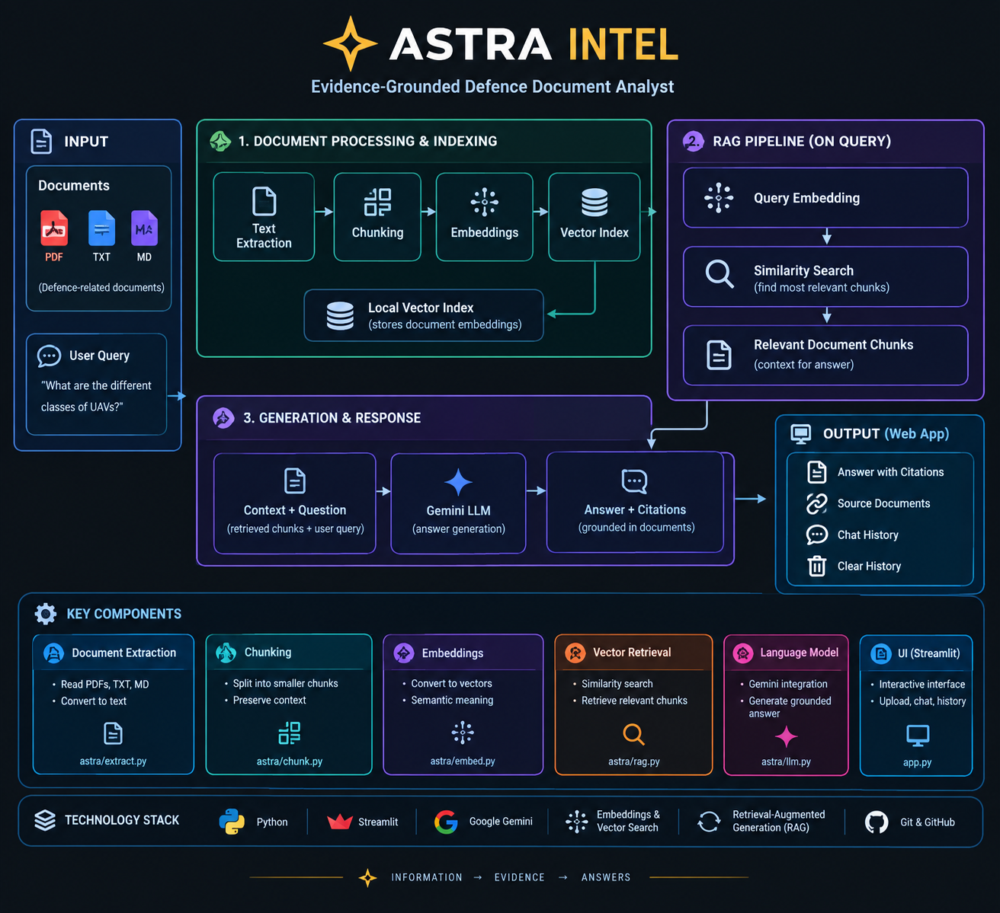

# ASTRA INTEL

Streamlit RAG application for evidence-grounded document Q&A.

## Run locally

```bash
cd ~/astra-intel
source .venv/bin/activate
pip install -r requirements.txt
streamlit run app.py
```

The app indexes the official challenge documents plus any files uploaded through the sidebar.

## Supported documents

- PDF
- TXT
- Markdown (`.md`)

Added files are stored in `sample-documents/additional/`.

## Gemini API key

Create `.env` locally (never commit it):

```text
GEMINI_API_KEY=your_key_here
```

For Streamlit Community Cloud, put the key in the app Secrets settings instead.

## Main features

- Multi-document upload
- Add documents without deleting existing documents
- Remove individual added documents
- Clear all added documents
- Grounded retrieval
- Gemini answer generation
- Page/section evidence
- Chat history and clear-history
- Duplicate upload protection

## Architecture




                         ┌──────────────────────┐
                         │        USER          │
                         │ Question / Upload    │
                         └──────────┬───────────┘
                                    │
                                    ▼
                    ┌─────────────────────────────┐
                    │     STREAMLIT FRONTEND      │
                    │          app.py             │
                    │ Chat • Upload • History     │
                    │ Clear / Remove              │
                    └───────┬─────────────┬───────┘
                            │             │
                Upload      │             │ Question
                            ▼             ▼
                 ┌────────────────┐  ┌──────────────────┐
                 │    DOCUMENT    │  │    RETRIEVAL     │
                 │   INGESTION    │  │  Similarity      │
                 │ PDF/TXT/MD     │  │  Search          │
                 └───────┬────────┘  │ PER_DOC_K = 6   │
                         │           └────────┬─────────┘
                         ▼                    │
                 ┌────────────────┐           │
                 │ PAGE-AWARE     │           │
                 │ CHUNKING       │           │
                 └───────┬────────┘           │
                         ▼                    │
                 ┌────────────────┐           │
                 │   MINILM       │           │
                 │  EMBEDDINGS    │           │
                 │ Text → Vector  │           │
                 └───────┬────────┘           │
                         ▼                    │
                 ┌────────────────┐◄──────────┘
                 │  VECTOR INDEX  │
                 │ Chunks +       │
                 │ Embeddings     │
                 └───────┬────────┘
                         │
                         ▼
                 ┌────────────────────┐
                 │ RETRIEVED CONTEXT  │
                 │ Relevant chunks +  │
                 │ document/page info │
                 └─────────┬──────────┘
                           ▼
                 ┌────────────────────┐
                 │ GEMINI 2.5 FLASH   │
                 │ Grounded Answer    │
                 │ Generation         │
                 └─────────┬──────────┘
                           ▼
                 ┌────────────────────┐
                 │ ANSWER + EVIDENCE  │
                 │ Document / Page    │
                 │ Citations          │
                 └─────────┬──────────┘
                           │
                           ▼
                 ┌────────────────────┐
                 │ STREAMLIT FRONTEND │
                 └────────────────────┘


                 